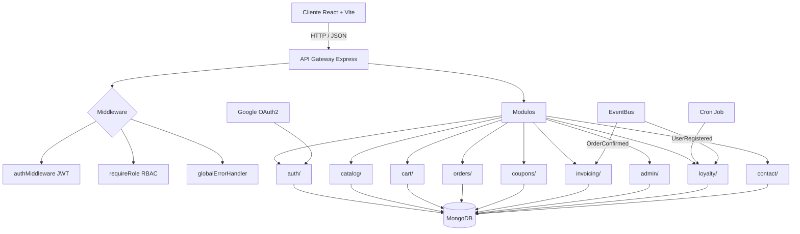

# CastellanStore

**E-commerce de relojería artesanal — Full-Stack con Node.js, React, TypeScript y MongoDB**

Plataforma completa de comercio electrónico con autenticación JWT + OAuth2, panel de administración con RBAC, carrito de compras sincronizado, sistema de cupones inteligente y facturación automatizada. Arquitectura modular con eventos asíncronos y pruebas de integración.

---

## Características Clave

- **Autenticación Dual**: Registro/Login tradicional (JWT + bcrypt) integrado con Social Login (Google OAuth2). Perfiles de usuario con actualización de datos.
- **Control de Acceso (RBAC)**: Roles diferenciados (`ROLE_USER` y `ROLE_MANAGER`) con middleware de autorización estricto en endpoints críticos de administración.
- **Carrito Sincronizado**: Persistencia local (localStorage) + sincronización automática con el backend cuando el usuario inicia sesión. Sin pérdida de datos entre dispositivos.
- **Fidelización Automatizada (Event-Driven)**: Sistema de eventos asíncronos (EventBus) que dispara listeners al registrar usuarios (cupón de bienvenida `BIENVENIDA10`) y al confirmar pedidos (generación de factura + email transaccional). Cron job diario para cupones de cumpleaños.
- **Panel de Administración Completo**: Dashboard con métricas en tiempo real (pedidos, ingresos, stock bajo), CRUD de productos, gestión de pedidos con transiciones de estado, y administración de cupones con búsqueda y paginación.
- **Sistema de Auditoría con Rollback**: Registro detallado de todas las acciones administrativas en `ActivityLog` con captura de `previousState`. Posibilidad de revertir cambios (rollback) directamente desde el panel de auditoría para acciones como actualización/eliminación de productos, cupones, cambios de rol, bloqueos y cambios de estado de pedidos.
- **Componentes Admin Reutilizables**: `AdminTable` con ordenación por columnas, paginación homogénea (20 registros) y `AdminModal` para visualización de detalle al hacer clic en cualquier fila, aplicado consistentemente en todas las tablas del panel (usuarios, productos, pedidos, cupones, actividad).
- **Pagos con Stripe**: Integración completa con Stripe (test mode) incluyendo `PaymentService` con creación de PaymentIntents, webhook para eventos `payment_intent.succeeded`, `charge.refunded`, y sistema de reembolsos (refunds) desde el panel admin. Lazy initialization para evitar crashes cuando Stripe no está configurado.
- **Webhook Event-Driven**: El webhook de Stripe se integra con el EventBus de la aplicación: al confirmarse un pago, emite `ORDER_CONFIRMED_EVENT` (genera factura PDF) y `ORDER_STATUS_CHANGED_EVENT` (envía email al cliente), manteniendo toda la cadena de eventos desacoplada.
- **Suite de Testing Automatizado**: 8 colecciones de Postman/Newman con 70+ aserciones que cubren autenticación, catálogo, pedidos, cupones, contacto, facturación y administración con verificación de RBAC.
- **Consistencia de Inventario**: Operaciones atómicas en MongoDB para evitar condiciones de carrera (race conditions) en la actualización de stock.

---

## Arquitectura y Diseño del Sistema



### Stack Tecnologico

| Capa | Tecnologia | Version |
|------|-----------|---------|
| **Frontend** | React + Vite + Tailwind CSS | React 19 / Vite 8 / Tailwind 4 |
| **Backend** | Node.js + Express + TypeScript | Node 22 / Express 5 / TS 5 |
| **Base de Datos** | MongoDB + Mongoose | MongoDB 7 / Mongoose 8 |
| **Autenticacion** | JWT (jsonwebtoken) + bcryptjs + Google OAuth2 | -- |
| **Testing** | Postman / Newman (CLI) | Newman 6 |
| **Tooling** | tsx (dev server), ESLint, Vite | -- |

---

## Instalacion y Despliegue Local

### Opcion 1: Docker Compose (recomendado)

Levanta los 3 contenedores (frontend + backend + MongoDB) con un solo comando:

```bash
# 1. Clonar el repositorio
git clone https://github.com/RdrgRffo/CastellanStore.git
cd CastellanStore

# 2. Configurar variables de entorno (opcional, valores por defecto incluidos)
cp frontend/.env.example frontend/.env
cp backend/.env.example backend/.env
# Editar frontend/.env y backend/.env con tus credenciales de Google OAuth si las tienes

# 3. Iniciar la aplicacion (asigna puertos libres automaticamente)
powershell -ExecutionPolicy Bypass -File start.ps1
```

El script `start.ps1` se encarga de:
- Verificar que Docker esté corriendo
- Limpiar contenedores previos
- Asignar puertos libres automáticamente (>8000)
- Generar la configuración de puertos dinámica
- Abrir una ventana con los logs de Docker en tiempo real
- Esperar a que el backend responda y mostrar un resumen con las URLs de acceso

También puedes ejecutar manualmente:

```bash
docker compose up --build
```

La aplicacion estara disponible en (puertos por defecto):
- **Frontend:** http://localhost:9099
- **Backend API:** http://localhost:9100
- **MongoDB:** localhost:27018 (mapeado desde 27017 interno)

> El seed automatico crea un usuario administrador por defecto:
> - **Email:** `admin@castellan.com`
> - **Contrasena:** `Admin123!`

### Opcion 2: Desarrollo local (sin Docker)

#### Requisitos previos

- Node.js >= 22
- MongoDB >= 7 (local o Docker)
- npm >= 10

#### Paso a paso

```bash
# 1. Clonar el repositorio
git clone https://github.com/RdrgRffo/CastellanStore.git
cd CastellanStore

# 2. Instalar dependencias (frontend + backend)
cd frontend && npm install && cd ..
cd backend && npm install && cd ..

# 3. Configurar variables de entorno
cp frontend/.env.example frontend/.env          # Frontend (VITE_GOOGLE_CLIENT_ID)
cp backend/.env.example backend/.env            # Backend (JWT_SECRET, MONGO_URI, GOOGLE_*)

# 4. Iniciar MongoDB (si usas Docker)
docker run -d -p 27017:27017 --name mongodb mongo:7

# 5. Arrancar el servidor de desarrollo
cd backend && npm run dev    # Backend -> http://localhost:9100
cd ../frontend && npm run dev # Frontend -> http://localhost:5173
```

> **Variables de entorno requeridas:**
> - `backend/.env`: `JWT_SECRET`, `MONGO_URI`, `GOOGLE_CLIENT_ID`, `GOOGLE_CLIENT_SECRET`
> - `frontend/.env`: `VITE_GOOGLE_CLIENT_ID`
>
> El seed automatico crea un usuario administrador por defecto:
> - **Email:** `admin@castellan.com`

---

## Suite de Testing y Calidad de Codigo

El proyecto incluye una suite completa de **pruebas de integracion** sobre la API REST, ejecutables con un solo comando:

```bash
cd test && powershell -ExecutionPolicy Bypass -File run-tests.ps1
# O en Linux/Mac: bash run-tests.sh
```

### Colecciones incluidas (8 suites, 70+ aserciones)

| Suite | Endpoints | Cobertura |
|-------|-----------|-----------|
| **Auth** | `POST /register`, `/login`, `/google`, `PUT /profile` | Registro, login, Google OAuth, actualizacion de perfil, errores 401/409 |
| **Watches** | `GET /watches`, `/watches/featured`, `/watches/:id` | Paginacion, busqueda, filtros, IDs invalidos |
| **Orders** | `POST /orders` | Creacion con autenticacion, generacion de orderNumber |
| **Coupons** | `POST /coupons/validate` | Validacion con/sin minimo, cupones inexistentes, autenticacion |
| **Contacts** | `POST /contacts` | Envio de mensajes, validacion de campos obligatorios |
| **Invoices** | `GET /invoices/:orderNumber` | Facturas existentes y no encontradas |
| **Admin Products** | `GET /admin/products`, `PATCH /admin/products/:id/stock` | CRUD, stock negativo, RBAC (403 para ROLE_USER, 401 sin token) |
| **Admin Orders** | `GET /admin/orders`, `PATCH /admin/orders/:id/status` | Filtros, transiciones de estado, RBAC |

Los archivos de coleccion estan en `test/*.json` y pueden importarse directamente en **Postman** o ejecutarse con **Newman**.

---

## Estructura del Proyecto

```
castellanstore/
├── frontend/                # Frontend (React + Vite)
│   ├── public/              # Assets estaticos (imagenes, db.json)
│   ├── src/
│   │   ├── components/      # Componentes reutilizables
│   │   ├── context/         # AuthContext, CartContext
│   │   ├── hooks/           # Custom hooks (useAuth, useCart, useProducts)
│   │   ├── pages/           # Paginas de la aplicacion
│   │   │   ├── Admin/       # Panel de administracion
│   │   │   ├── Auth/        # Login / Registro
│   │   │   ├── Cart/        # Carrito
│   │   │   ├── Checkout/    # Proceso de compra
│   │   │   ├── Help/        # FAQ, Envios, Garantia, Contacto
│   │   │   ├── Home/        # Pagina principal
│   │   │   ├── Orders/      # Mis pedidos
│   │   │   ├── Product/     # Detalle de producto
│   │   │   ├── Profile/     # Perfil de usuario
│   │   │   └── Shop/        # Catalogo
│   │   └── services/        # api.js (capa de acceso a datos)
│   ├── package.json
│   ├── vite.config.js
│   └── Dockerfile
├── backend/                  # Backend (Express + TypeScript)
│   ├── src/
│   │   ├── admin/           # Dashboard, cupones (panel admin)
│   │   ├── auth/            # Autenticacion, usuarios, JWT, Google OAuth
│   │   ├── cart/            # Carrito de compras (modelo + servicio)
│   │   ├── catalog/         # Catalogo de productos (watches)
│   │   ├── config/          # Conexion a MongoDB
│   │   ├── contact/         # Formulario de contacto
│   │   ├── coupons/         # Cupones de descuento
│   │   ├── invoicing/       # Facturacion + listener de eventos
│   │   ├── loyalty/         # Fidelizacion (cupon bienvenida, cumpleanos)
│   │   ├── notifications/   # Email transaccional (Resend + plantillas HTML)
│   │   ├── orders/          # Pedidos + servicio
│   │   └── shared/          # Middleware, utils, eventos, ApiResponse
│   ├── package.json
│   └── Dockerfile
├── docs/                    # Documentación del proyecto
│   ├── studyCase.md         # Caso de estudio detallado
│   └── agentGuide.md        # Guía técnica para el agente IA
├── test/                    # Colecciones Postman / Newman
├── .github/workflows/       # CI/CD Pipeline (GitHub Actions)
├── docker-compose.yml
├── start.ps1                # Script de inicio (PowerShell)
├── start.sh                 # Script de inicio (Bash)
└── README.md
```

---

## Sistema de Email Transaccional (Resend)

El proyecto incluye un sistema completo de email transaccional basado en eventos, con integración a la API de Resend.

### Configuración

Para activar el envío real de emails, configura las siguientes variables en `backend/.env`:

```env
RESEND_API_KEY=re_tu_api_key_aqui
RESEND_FROM=Castellan Store <no-reply@tudominio.com>
```

> Si no se configuran, los emails se simularán en consola con el prefijo `[EMAIL SIMULATED]`.

### Eventos y plantillas

| Evento | Plantilla | Descripción |
|--------|-----------|-------------|
| `USER_REGISTERED_EVENT` | `welcomeEmailHtml()` | Email de bienvenida con código de descuento `BIENVENIDA10` (10% off) |
| `ORDER_CONFIRMED_EVENT` | `orderConfirmationHtml()` | Confirmación de pedido con tabla de items, subtotal, descuento, envío y total |
| `ORDER_STATUS_CHANGED_EVENT` | `orderStatusHtml()` | Actualización de estado con emoji según estado (pendiente, confirmado, enviado, entregado, cancelado) |
| Generación de factura | `invoiceEmailHtml()` | Notificación de factura disponible con PDF adjunto |

### Arquitectura

```
EventBus (eventos asíncronos)
  ├── USER_REGISTERED_EVENT
  │   ├── LoyaltyListener → Crea perfil de fidelización + cupón BIENVENIDA10
  │   └── NotificationListener → Envía email de bienvenida
  │
  ├── ORDER_CONFIRMED_EVENT
  │   ├── InvoiceListener → Genera factura + PDF
  │   └── NotificationListener → Envía confirmación de pedido
  │
  └── ORDER_STATUS_CHANGED_EVENT
      └── NotificationListener → Envía actualización de estado
```

### Archivos relacionados

| Archivo | Descripción |
|---------|-------------|
| `backend/src/notifications/EmailService.ts` | Integración con API de Resend + 5 plantillas HTML responsive |
| `backend/src/notifications/NotificationService.ts` | Servicio de notificaciones que orquesta el envío |
| `backend/src/notifications/NotificationListener.ts` | Listeners de eventos para notificaciones |
| `backend/src/loyalty/LoyaltyListener.ts` | Listener de registro que también envía email de bienvenida |
| `backend/src/invoicing/InvoiceService.ts` | Generación de facturas con PDF adjunto por email |

### Diseño visual

Las plantillas HTML incluyen:
- **Header** con gradiente oscuro y marca CASTELLAN en dorado
- **Cuerpo** con tipografía limpia y espaciado generoso
- **Footer** con información de contacto y copyright
- **Responsive** para dispositivos móviles
- **Colores corporativos**: dorado `#8B6B4A`, fondo oscuro `#1a1a2e`, blanco hueso `#faf6f0`

---

## Decisiones Tecnicas

- **Arquitectura modular por dominio** en el backend (`auth/`, `orders/`, `coupons/`, etc.) en lugar de una estructura MVC plana. Cada modulo es autocontenido con su modelo, servicio, controlador y rutas.
- **EventBus propio** (patron Observer) para desacoplar flujos secundarios: el registro de usuarios dispara la creacion del perfil de fidelidad y la asignacion del cupon de bienvenida sin bloquear la respuesta HTTP.
- **Operaciones atomicas** (`findOneAndUpdate` con `$inc`) para el control de stock, evitando race conditions en escenarios de alta concurrencia.
- **Capa de servicios (`api.js`)** que abstrae `apiClient` y normaliza las respuestas, permitiendo que los componentes consuman datos sin conocer la estructura de red subyacente.
- **Carrito hibrido**: localStorage para usuarios anonimos + API sincronizada para usuarios autenticados, con fusion automatica al iniciar sesion.

---

## Licencia
Este proyecto es de código abierto. Consulta el archivo de licencia para más detalles.

---

## Autor
**Rodrigo Riffo** - [@RdrgRffo](https://github.com/RdrgRffo)
