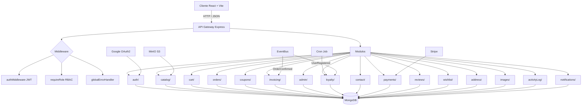

# CastellanStore

**E-commerce de relojería artesanal — Full-Stack con Node.js, React, TypeScript y MongoDB**

Plataforma completa de comercio electrónico con autenticación JWT + OAuth2, panel de administración con RBAC, carrito de compras sincronizado, sistema de cupones inteligente, facturación automatizada, pagos con Stripe, almacenamiento de imágenes con MinIO (S3), wishlist, reviews, y más. Arquitectura modular con eventos asíncronos y suite completa de testing.

---

## Características Clave

- **Autenticación Dual**: Registro/Login tradicional (JWT + bcrypt) integrado con Social Login (Google OAuth2). Perfiles de usuario con actualización de datos.
- **Control de Acceso (RBAC)**: Roles diferenciados (`ROLE_USER` y `ROLE_MANAGER`) con middleware de autorización estricto en endpoints críticos de administración.
- **Carrito Sincronizado**: Persistencia local (localStorage) + sincronización automática con el backend cuando el usuario inicia sesión. Sin pérdida de datos entre dispositivos.
- **Wishlist**: Lista de deseos persistente con toggle desde catálogo y detalle de producto.
- **Reviews y Valoraciones**: Sistema de reseñas con puntuación (1-5 estrellas) asociadas a productos y usuarios.
- **Fidelización Automatizada (Event-Driven)**: Sistema de eventos asíncronos (EventBus) que dispara listeners al registrar usuarios (cupón de bienvenida `BIENVENIDA10`) y al confirmar pedidos (generación de factura + email transaccional). Cron job diario para cupones de cumpleaños.
- **Panel de Administración Completo**: Dashboard con métricas en tiempo real (pedidos, ingresos, stock bajo), CRUD de productos, gestión de pedidos con transiciones de estado, administración de cupones, usuarios y registro de actividad con búsqueda y paginación.
- **Sistema de Auditoría con Rollback**: Registro detallado de todas las acciones administrativas en `ActivityLog` con captura de `previousState`. Posibilidad de revertir cambios (rollback) directamente desde el panel de auditoría para acciones como actualización/eliminación de productos, cupones, cambios de rol, bloqueos y cambios de estado de pedidos.
- **Componentes Admin Reutilizables**: `AdminTable` con ordenación por columnas, paginación homogénea (20 registros) y `AdminModal` para visualización de detalle al hacer clic en cualquier fila, aplicado consistentemente en todas las tablas del panel (usuarios, productos, pedidos, cupones, actividad).
- **Pagos con Stripe**: Integración completa con Stripe (test mode) incluyendo `PaymentService` con creación de PaymentIntents, webhook para eventos `payment_intent.succeeded`, `charge.refunded`, y sistema de reembolsos (refunds) desde el panel admin. Lazy initialization para evitar crashes cuando Stripe no está configurado.
- **Webhook Event-Driven**: El webhook de Stripe se integra con el EventBus de la aplicación: al confirmarse un pago, emite `ORDER_CONFIRMED_EVENT` (genera factura PDF) y `ORDER_STATUS_CHANGED_EVENT` (envía email al cliente), manteniendo toda la cadena de eventos desacoplada.
- **Almacenamiento de Imágenes con MinIO (S3)**: Subida, gestión y servido de imágenes de productos mediante MinIO compatible con API S3 de AWS.
- **Suite de Testing Automatizado**: 20+ colecciones de Postman/Newman con aserciones que cubren autenticación, catálogo, pedidos, cupones, contacto, facturación, pagos, direcciones, wishlist, reviews, imágenes y administración con verificación de RBAC.
- **Consistencia de Inventario**: Operaciones atómicas en MongoDB para evitar condiciones de carrera (race conditions) en la actualización de stock.

---

## Arquitectura y Diseño del Sistema



### Stack Tecnológico

| Capa | Tecnología | Versión |
|------|-----------|---------|
| **Frontend** | React + Vite + Tailwind CSS | React 19 / Vite 8 / Tailwind 3 |
| **Backend** | Node.js + Express + TypeScript | Node 22 / Express 4 / TS 5 |
| **Base de Datos** | MongoDB + Mongoose | MongoDB 7 / Mongoose 8 |
| **Almacenamiento** | MinIO (S3-compatible) | latest |
| **Autenticación** | JWT (jsonwebtoken) + bcryptjs + Google OAuth2 | -- |
| **Pagos** | Stripe | SDK 22 |
| **Testing** | Postman / Newman (CLI) | Newman 6 |
| **Tooling** | tsx (dev server), ESLint, Vite | -- |

---

## Instalación y Despliegue Local

### Opción 1: Docker Compose (recomendado)

Levanta los 4 contenedores (frontend + backend + MongoDB + MinIO) con un solo comando:

```bash
# 1. Clonar el repositorio
git clone https://github.com/RdrgRffo/CastellanStore.git
cd CastellanStore

# 2. Configurar variables de entorno (opcional, valores por defecto incluidos)
cp frontend/.env.example frontend/.env
cp backend/.env.example backend/.env
# Editar frontend/.env y backend/.env con tus credenciales si las tienes

# 3. Iniciar la aplicación
docker compose up --build
```

La aplicación estará disponible en (puertos por defecto):
- **Frontend:** http://localhost:9099
- **Backend API:** http://localhost:9100
- **MongoDB:** localhost:27017
- **MinIO Console:** http://localhost:9001 (admin/minioadmin)
- **MinIO API:** http://localhost:9000

> El seed automático crea un usuario administrador por defecto:
> - **Email:** `admin@castellan.com`
> - **Contraseña:** `Admin123!`

### Opción 2: Desarrollo local (sin Docker)

#### Requisitos previos

- Node.js >= 22
- MongoDB >= 7 (local o Docker)
- MinIO (local o Docker) — opcional, para imágenes
- npm >= 10

#### Paso a paso

```bash
# 1. Clonar el repositorio
git clone https://github.com/RdrgRffo/CastellanStore.git
cd CastellanStore

# 2. Instalar dependencias (frontend + backend)
cd frontend && npm install && cd ..
cd backend && npm install && cd ..

# 3. Configurar variables de entorno
cp frontend/.env.example frontend/.env          # Frontend (VITE_GOOGLE_CLIENT_ID)
cp backend/.env.example backend/.env            # Backend (JWT_SECRET, MONGO_URI, GOOGLE_*, MINIO_*, etc.)

# 4. Iniciar MongoDB y MinIO (si usas Docker)
docker run -d -p 27017:27017 --name mongodb mongo:7
docker run -d -p 9000:9000 -p 9001:9001 --name minio \
  -e MINIO_ROOT_USER=minioadmin \
  -e MINIO_ROOT_PASSWORD=minioadmin \
  minio/minio server /data --console-address ":9001"

# 5. Arrancar el servidor de desarrollo
cd backend && npm run dev      # Backend -> http://localhost:9100
cd ../frontend && npm run dev  # Frontend -> http://localhost:5173
```

> **Variables de entorno requeridas:**
> - `backend/.env`: `JWT_SECRET`, `MONGO_URI`, `GOOGLE_CLIENT_ID`, `GOOGLE_CLIENT_SECRET`, `MINIO_*`
> - `frontend/.env`: `VITE_GOOGLE_CLIENT_ID`
>
> El seed automático crea un usuario administrador por defecto:
> - **Email:** `admin@castellan.com`

---

## Suite de Testing y Calidad de Código

El proyecto incluye una suite completa de **pruebas de integración** sobre la API REST, ejecutables con un solo comando:

```bash
cd test && powershell -ExecutionPolicy Bypass -File run-tests.ps1
# O en Linux/Mac: bash run-tests.sh
```

### Colecciones incluidas (20+ suites)

| Suite | Endpoints | Cobertura |
|-------|-----------|-----------|
| **Auth** | `POST /register`, `/login`, `/google`, `PUT /profile` | Registro, login, Google OAuth, actualización de perfil, errores 401/409 |
| **Watches** | `GET /watches`, `/watches/featured`, `/watches/:id` | Paginación, búsqueda, filtros, IDs inválidos |
| **Cart** | `GET /cart`, `POST /cart`, `PUT /cart/:id`, `DELETE /cart` | CRUD completo del carrito |
| **Orders** | `POST /orders` | Creación con autenticación, generación de orderNumber |
| **Cancel Order** | `POST /orders/:id/cancel` | Cancelación de pedidos |
| **Coupons** | `POST /coupons/validate` | Validación con/sin mínimo, cupones inexistentes, autenticación |
| **Contacts** | `POST /contacts` | Envío de mensajes, validación de campos obligatorios |
| **Invoices** | `GET /invoices/:orderNumber` | Facturas existentes y no encontradas |
| **Invoice PDF** | `GET /invoices/:orderNumber/pdf` | Descarga de PDF de factura |
| **Payments** | `POST /payments/create-intent`, webhooks | Creación de PaymentIntent, eventos de Stripe |
| **Addresses** | `GET /addresses`, `POST /addresses`, `PUT /addresses/:id` | CRUD de direcciones de envío |
| **Wishlist** | `GET /wishlist`, `POST /wishlist`, `DELETE /wishlist/:id` | CRUD de lista de deseos |
| **Reviews** | `GET /reviews/:productId`, `POST /reviews` | Reseñas de productos |
| **Images** | `POST /images/upload` | Subida de imágenes a MinIO |
| **Session** | `GET /auth/session` | Verificación de sesión activa |
| **Admin Dashboard** | `GET /admin/dashboard` | Métricas y estadísticas |
| **Admin Products** | `GET /admin/products`, `POST /admin/products`, `PATCH /admin/products/:id/stock` | CRUD, stock negativo, RBAC |
| **Admin Orders** | `GET /admin/orders`, `PATCH /admin/orders/:id/status` | Filtros, transiciones de estado, RBAC |
| **Admin Users** | `GET /admin/users`, `PATCH /admin/users/:id/role` | Gestión de usuarios, cambio de roles |
| **Admin Coupons** | `GET /admin/coupons`, `POST /admin/coupons`, `PATCH /admin/coupons/:id` | CRUD de cupones desde admin |
| **Admin Activity Logs** | `GET /admin/activity-logs` | Registro de auditoría |

Los archivos de colección están en `test/*.json` y pueden importarse directamente en **Postman** o ejecutarse con **Newman**.

---

## Estructura del Proyecto

```
castellanstore/
├── frontend/                    # Frontend (React + Vite)
│   ├── public/                  # Assets estáticos (imágenes, db.json)
│   │   ├── db.json              # Datos semilla para json-server
│   │   └── images/              # Imágenes de productos
│   ├── src/
│   │   ├── components/          # Componentes reutilizables
│   │   │   ├── dashboard/       # Componentes del dashboard admin
│   │   │   ├── layout/          # Header, Footer, Sidebar, Hero
│   │   │   └── ui/              # AdminTable, AdminModal, Badge, etc.
│   │   ├── context/             # AuthContext, CartContext, ToastContext, WishlistContext
│   │   ├── data/                # Datos estáticos (spanishCities.js)
│   │   ├── hooks/               # Custom hooks (useAuth, useCart, useProducts, etc.)
│   │   ├── pages/               # Páginas de la aplicación
│   │   │   ├── About/           # Acerca de
│   │   │   ├── Admin/           # Panel de administración
│   │   │   ├── Auth/            # Login / Registro
│   │   │   ├── Cart/            # Carrito
│   │   │   ├── Checkout/        # Proceso de compra
│   │   │   ├── Compare/         # Comparador de productos
│   │   │   ├── Help/            # FAQ, Envíos, Garantía, Contacto
│   │   │   ├── Home/            # Página principal
│   │   │   ├── NotFound/        # Página 404
│   │   │   ├── Orders/          # Mis pedidos
│   │   │   ├── Product/         # Detalle de producto
│   │   │   ├── Profile/         # Perfil de usuario
│   │   │   └── Shop/            # Catálogo
│   │   ├── services/            # api.js, apiClient.js, cartService.js, couponService.js
│   │   └── utils/               # formatPrice.js, FormValidator.js, specLabels.js
│   ├── package.json
│   ├── vite.config.js
│   └── Dockerfile
├── backend/                      # Backend (Express + TypeScript)
│   ├── src/
│   │   ├── activityLog/         # Registro de auditoría
│   │   ├── address/             # Direcciones de envío
│   │   ├── admin/               # Dashboard, cupones, usuarios (panel admin)
│   │   ├── auth/                # Autenticación, usuarios, JWT, Google OAuth
│   │   ├── cart/                # Carrito de compras (modelo + servicio)
│   │   ├── catalog/             # Catálogo de productos (watches)
│   │   ├── config/              # Conexión a MongoDB
│   │   ├── contact/             # Formulario de contacto
│   │   ├── coupons/             # Cupones de descuento
│   │   ├── images/              # Subida y gestión de imágenes (MinIO S3)
│   │   ├── invoicing/           # Facturación + listener de eventos
│   │   ├── loyalty/             # Fidelización (cupón bienvenida, cumpleaños)
│   │   ├── notifications/       # Email transaccional (Resend + plantillas HTML)
│   │   ├── orders/              # Pedidos + servicio
│   │   ├── payments/            # Integración con Stripe
│   │   ├── reviews/             # Reseñas de productos
│   │   ├── shared/              # Middleware, utils, eventos, ApiResponse
│   │   └── wishlist/            # Lista de deseos
│   ├── package.json
│   └── Dockerfile
├── docs/                        # Documentación del proyecto
│   ├── studyCase.md             # Caso de estudio detallado
│   └── agentGuide.md            # Guía técnica para el agente IA
├── test/                        # Colecciones Postman / Newman (20+ suites)
├── .github/workflows/           # CI/CD Pipeline (GitHub Actions)
├── docker-compose.yml           # 4 servicios: frontend + backend + mongodb + minio
├── Dockerfile                   # Frontend (multi-stage: build + nginx)
└── README.md
```

---

## Sistema de Email Transaccional (Resend)

El proyecto incluye un sistema completo de email transaccional basado en eventos, con integración a la API de Resend.

### Configuración

Para activar el envío real de emails, configura las siguientes variables en `backend/.env`:

```env
RESEND_API_KEY=re_tu_api_key_aqui
RESEND_FROM=Castellan Store <no-reply@tudominio.com>
```

> Si no se configuran, los emails se simularán en consola con el prefijo `[EMAIL SIMULATED]`.

### Eventos y plantillas

| Evento | Plantilla | Descripción |
|--------|-----------|-------------|
| `USER_REGISTERED_EVENT` | `welcomeEmailHtml()` | Email de bienvenida con código de descuento `BIENVENIDA10` (10% off) |
| `ORDER_CONFIRMED_EVENT` | `orderConfirmationHtml()` | Confirmación de pedido con tabla de items, subtotal, descuento, envío y total |
| `ORDER_STATUS_CHANGED_EVENT` | `orderStatusHtml()` | Actualización de estado con emoji según estado (pendiente, confirmado, enviado, entregado, cancelado) |
| Generación de factura | `invoiceEmailHtml()` | Notificación de factura disponible con PDF adjunto |

### Arquitectura

```
EventBus (eventos asíncronos)
  ├── USER_REGISTERED_EVENT
  │   ├── LoyaltyListener → Crea perfil de fidelización + cupón BIENVENIDA10
  │   └── NotificationListener → Envía email de bienvenida
  │
  ├── ORDER_CONFIRMED_EVENT
  │   ├── InvoiceListener → Genera factura + PDF
  │   └── NotificationListener → Envía confirmación de pedido
  │
  └── ORDER_STATUS_CHANGED_EVENT
      └── NotificationListener → Envía actualización de estado
```

### Archivos relacionados

| Archivo | Descripción |
|---------|-------------|
| `backend/src/notifications/EmailService.ts` | Integración con API de Resend + 5 plantillas HTML responsive |
| `backend/src/notifications/NotificationService.ts` | Servicio de notificaciones que orquesta el envío |
| `backend/src/notifications/NotificationListener.ts` | Listeners de eventos para notificaciones |
| `backend/src/loyalty/LoyaltyListener.ts` | Listener de registro que también envía email de bienvenida |
| `backend/src/invoicing/InvoiceService.ts` | Generación de facturas con PDF adjunto por email |

### Diseño visual

Las plantillas HTML incluyen:
- **Header** con gradiente oscuro y marca CASTELLAN en dorado
- **Cuerpo** con tipografía limpia y espaciado generoso
- **Footer** con información de contacto y copyright
- **Responsive** para dispositivos móviles
- **Colores corporativos**: dorado `#8B6B4A`, fondo oscuro `#1a1a2e`, blanco hueso `#faf6f0`

---

## Almacenamiento de Imágenes (MinIO S3)

El proyecto utiliza **MinIO** como almacenamiento de objetos compatible con S3 para las imágenes de productos.

### Configuración

Variables en `backend/.env`:

```env
MINIO_ENDPOINT=http://localhost:9000
MINIO_PUBLIC_URL=http://localhost:9000
MINIO_ACCESS_KEY=minioadmin
MINIO_SECRET_KEY=minioadmin
MINIO_BUCKET=castellan-images
```

### Endpoints

| Método | Ruta | Descripción |
|--------|------|-------------|
| `POST` | `/api/images/upload` | Sube una imagen y devuelve la URL pública |
| `GET` | `/api/images/:filename` | Obtiene una imagen por nombre |

> En Docker Compose, MinIO se configura automáticamente con healthcheck y volúmenes persistentes.

---

## Decisiones Técnicas

- **Arquitectura modular por dominio** en el backend (`auth/`, `orders/`, `coupons/`, etc.) en lugar de una estructura MVC plana. Cada módulo es autocontenido con su modelo, servicio, controlador y rutas.
- **EventBus propio** (patrón Observer) para desacoplar flujos secundarios: el registro de usuarios dispara la creación del perfil de fidelidad y la asignación del cupón de bienvenida sin bloquear la respuesta HTTP.
- **Operaciones atómicas** (`findOneAndUpdate` con `$inc`) para el control de stock, evitando race conditions en escenarios de alta concurrencia.
- **Capa de servicios (`api.js`)** que abstrae `apiClient` y normaliza las respuestas, permitiendo que los componentes consuman datos sin conocer la estructura de red subyacente.
- **Carrito híbrido**: localStorage para usuarios anónimos + API sincronizada para usuarios autenticados, con fusión automática al iniciar sesión.
- **Almacenamiento S3 con MinIO**: Las imágenes se almacenan externamente en un bucket S3 compatible, permitiendo escalabilidad y separación de concerns.
- **Frontend en JSX (no TypeScript)**: El frontend utiliza JavaScript con JSX para mayor simplicidad, mientras que el backend está completamente tipado con TypeScript.

---

## Licencia
Este proyecto es de código abierto. Consulta el archivo de licencia para más detalles.

---

## Autor
**Rodrigo Riffo** - [@RdrgRffo](https://github.com/RdrgRffo)
